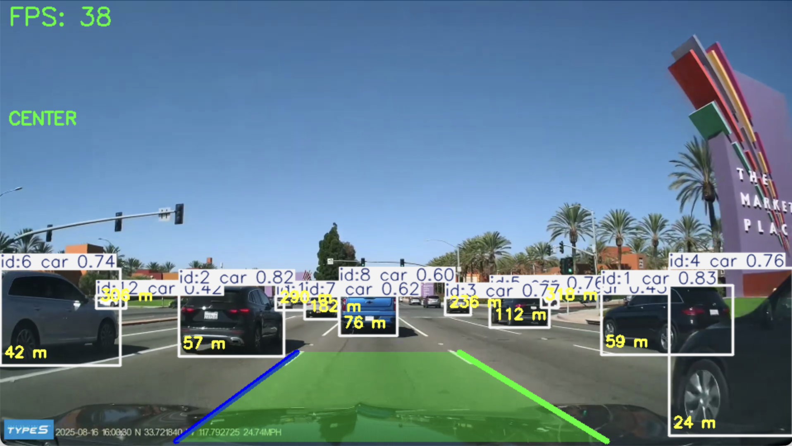

# Real-Time ADAS System using YOLO and Computer Vision


## Overview

A real-time Advanced Driver Assistance System (ADAS) prototype built with YOLOv8, ByteTrack, and classical computer vision. The system detects vehicles, tracks lane boundaries, estimates steering direction, and raises lane-departure and forward-collision warnings — developed as a hands-on exploration of perception pipelines in autonomous driving.

## Features

- Real-time vehicle detection using YOLO
- Multi-object tracking with ByteTrack
- Lane detection using Canny Edge Detection and Hough Transform
- Lane filtering and classification
- Temporal smoothing for stable lane tracking
- Lane departure warning system
- Steering direction estimation (Left / Right / Center)
- Forward collision warning
- Distance estimation based on object size
- Real-time video processing

## Technologies

- Python
- OpenCV
- Ultralytics YOLO
- ByteTrack
- NumPy

## Installation

**Requirements:** Python 3.10 or higher

Clone the repository:

```bash
git clone https://github.com/saide-29/adas-perception-system.git
cd adas-perception-system
```

Install the required packages:

```bash
pip install -r requirements.txt
```

**Main dependencies:**

- ultralytics
- opencv-python
- numpy

Download the YOLO model (`yolov8n.pt`) and save it as `models/yolov8n.pt`.

Sample videos are included in the `videos/` directory. You may also use your own video by updating the video path in `main.py`.

## Usage

Run the project:

```bash
python3 main.py
```

The video source and model path are currently defined inside `main.py`.

**Default configuration:**

```python
model = YOLO("models/yolov8n.pt")
cap = cv2.VideoCapture("videos/road.mp4")
```

To test the system with a different video, update the video path in `main.py`.

## Project Structure

```text
adas-perception-system/
│
├── demo/
├── models/
│   └── yolov8n.pt
├── videos/
│   ├── road.mp4
│   └── road2.mp4
├── .gitignore
├── main.py
├── README.md
└── requirements.txt
```

## Perception Pipeline

1. Video Input
2. Vehicle Detection (YOLO)
3. Multi-Object Tracking (ByteTrack)
4. Lane Detection
   - Grayscale Conversion
   - Gaussian Blur
   - White Lane Filtering
   - Canny Edge Detection
   - Region of Interest (ROI)
   - Hough Transform
5. Lane Classification
6. Lane Fitting using Polyfit
7. Temporal Smoothing
8. Lane Departure Warning
9. Steering Direction Estimation
10. Forward Collision Warning
11. Distance Estimation
12. Visualization and User Interface

## Challenges and Improvements

| Challenge                                                       | Solution                                           |
| --------------------------------------------------------------- | -------------------------------------------------- |
| Right lane instability caused by noisy detections               | Applied temporal smoothing and lane filtering      |
| False lane detections from road textures, shadows, and vehicles | Used ROI tuning and candidate line filtering       |
| Unstable lane departure warnings                                | Adjusted lane departure and steering thresholds    |
| Inconsistent right lane tracking                                | Improved lane classification and filtering logic   |
| Too many edge detections caused by shadows and lighting changes | Applied Gaussian Blur and white lane filtering     |
| False forward collision warnings                                | Added object position filtering using frame center |

## Future Improvements

- Traffic light state recognition
- Curved lane fitting
- Time-To-Collision (TTC) estimation
- Speed estimation
- Perspective transformation
- Lane segmentation using deep learning
- Advanced tracking and filtering methods

## Demo



*Sample output of the ADAS perception system.*

## Skills Demonstrated

- Object Detection
- Multi-Object Tracking
- Lane Detection
- Lane Tracking and Smoothing
- Real-Time Video Processing
- ADAS System Design
- Warning System Development
- Image Processing with OpenCV
- Computer Vision Debugging
- System Tuning and Optimization

## License

This project is licensed under the MIT License — see the [LICENSE](LICENSE) file for details.
